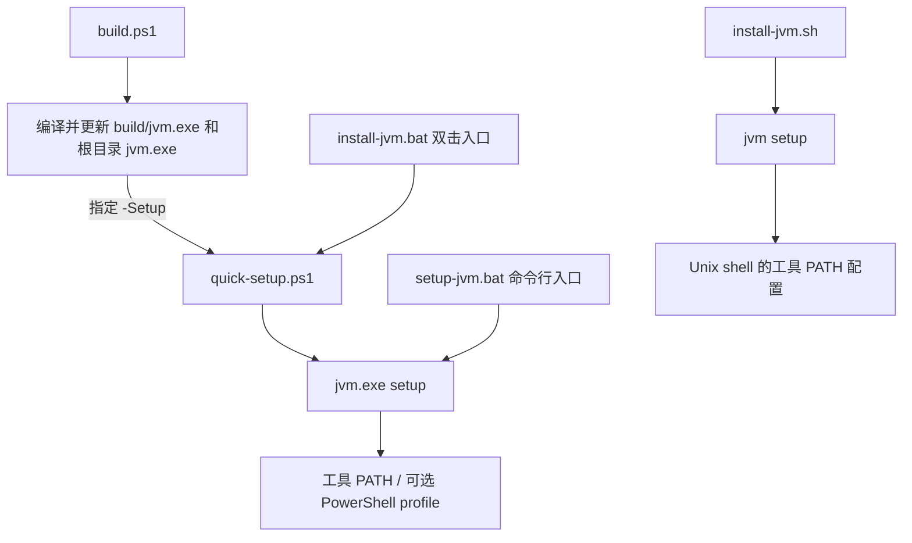

# 构建与安装脚本使用指南

这五个脚本分别服务于源码构建、终端配置和双击安装，**不需要依次全部运行**。它们配置的是 `jvm` 工具入口；安装 JDK 使用 `jvm install`，选择 Java 使用 `jvm use`。

## 先选一个入口

| 你的场景 | 推荐入口 | 是否需要 Go | 是否修改持久环境 |
|---|---|---|---|
| Windows，从源码编译并配置使用 | `build.ps1 -Setup` | Go 1.21 或更高版本 | 是，编译成功后调用 PowerShell 安装脚本 |
| Windows，只重新编译、更新本仓库的程序 | `build.ps1` | 是 | 否 |
| Windows，已有 exe，在 PowerShell 安装或更新 | `quick-setup.ps1` | 否 | 用户 PATH 与当前 PowerShell 的用户 profile |
| Windows，已有 exe，想双击安装 | `install-jvm.bat` | 否 | 同上，通过 Windows PowerShell 执行 |
| Windows，在 CMD 或批处理里配置工具 PATH | `setup-jvm.bat` | 否 | 用户 PATH；只有显式传 profile 参数才配置集成 |
| Linux/macOS，已有对应平台的可执行文件 | `install-jvm.sh` | 否 | 工具检测到的 shell 配置文件 |

Windows PowerShell 与 PowerShell 7 的 profile 分开存放。`install-jvm.bat` 调用的是 `powershell.exe`，配置 Windows PowerShell；使用 PowerShell 7 时，在 `pwsh` 中直接运行 `quick-setup.ps1`。

## 脚本之间的关系



所有安装脚本都使用**脚本所在目录**的程序，不会从网络下载 JVM 工具，也不会优先调用 PATH 上碰巧存在的旧程序。Windows 脚本旁需要 `jvm.exe`，Unix 脚本旁需要可执行的 `jvm`。`install-jvm.bat` 还需要旁边的 `quick-setup.ps1`。

## 1. build.ps1：Windows 源码构建与更新

在源码目录打开 PowerShell：

```powershell
Set-Location "E:\jvm"
.\build.ps1
.\jvm.exe --version
```

脚本先编译临时程序，再更新 `E:\jvm\build\jvm.exe` 和 `E:\jvm\jvm.exe`。编译失败不替换已有程序；如果发布阶段根目录 exe 被占用，可能出现 build 产物已更新、根目录替换失败的情况，脚本会明确报错。关闭占用它的进程后重试。

| 参数 | 默认值 | 行为 |
|---|---|---|
| `-Setup` | 不启用 | 两处程序更新成功后，调用根目录 `quick-setup.ps1`，使用仓库目录作为工具位置 |

第一次从源码开始使用可以执行：

```powershell
.\build.ps1 -Setup
jvm --version
jvm list available
```

`build.ps1` 不接受 `-InstallPath`。如果希望工具放在其他目录，需要分两步：

```powershell
.\build.ps1
.\quick-setup.ps1 -InstallPath "D:\Tools\jvm"
```

以后更新也执行这两步。**单独构建只更新仓库内两份 exe，不会更新之前复制到 `D:\Tools\jvm` 的程序。** 同样，已经使用独立工具目录时，不要用 `build.ps1 -Setup` 代替更新步骤，否则它会把集成重新指向仓库目录。

此脚本用于 Windows 构建，不是交叉编译入口。需要其他平台产物时使用 `go build`；直接运行 `go build -o build/jvm.exe .` 也不会自动同步根目录 exe。

## 2. quick-setup.ps1：PowerShell 安装与立即使用

已有同目录 `jvm.exe` 时，直接在当前 PowerShell 执行：

```powershell
.\quick-setup.ps1
jvm --version
```

默认使用脚本目录作为工具目录，不复制到 C 盘或其他固定位置。指定目标目录时：

```powershell
.\quick-setup.ps1 -InstallPath "D:\Tools\jvm"
```

| 参数 | 默认值 | 行为 |
|---|---|---|
| `-InstallPath <目录>` | 脚本所在目录 | 把 exe 复制到目标目录并配置该目录；相对路径按调用时的工作目录解析 |
| `-Force` | `$true` | 允许替换目标目录内旧 exe；使用 `-Force:$false` 禁止覆盖 |
| `-NoProfile` | 不启用 | 跳过持久 profile 写入；仍配置持久用户 PATH，并在当前会话加载函数 |

执行成功后会：

1. 调用 `jvm.exe setup` 配置用户 PATH，以及运行脚本的 PowerShell 的 `$PROFILE.CurrentUserAllHosts`。
2. 把实际工具目录加入当前会话 PATH 的前面。
3. 通过实际目标 exe 生成并加载 `jvm` 函数。
4. 执行 `jvm --version` 检查结果。

profile 只维护 JVM 的标记块，保留其他内容。新窗口读取该 profile 后加载函数，`jvm use` 等命令成功时能同步激活当前 PowerShell。使用 `-NoProfile` **不会删除以前写入的集成块**，它只跳过本次写入。

```powershell
# 不写入 profile，但当前窗口仍可立即使用
.\quick-setup.ps1 -NoProfile

# 目标已存在时拒绝替换
.\quick-setup.ps1 -InstallPath "D:\Tools\jvm" -Force:$false
```

直接执行 `.\quick-setup.ps1` 可以更新当前 PowerShell。若使用 `powershell.exe -File ...` 启动子进程，立即激活只发生在子进程里，不能修改调用它的父终端。

## 3. install-jvm.bat：Windows 双击安装

把以下文件放在同一个目录，双击 `install-jvm.bat`：

```text
jvm.exe
quick-setup.ps1
install-jvm.bat
```

它会启动 Windows PowerShell，调用 `quick-setup.ps1`，成功和失败都会暂停，让你看清结果。成功后关闭安装窗口，再打开终端使用 `jvm`。不要把它用于无人值守脚本，因为它会等待按键。

也可以从 CMD 指定安装目录，参数会转交给 PowerShell 脚本：

```bat
install-jvm.bat -InstallPath "D:\Tools\jvm"
install-jvm.bat -NoProfile
```

这里使用 **`-InstallPath`**，不是 `--path`。需要 `-Force:$false` 等 PowerShell 布尔参数时，直接在 PowerShell 调用 `quick-setup.ps1`，避免旧版 `powershell.exe -File` 的参数传递限制。

BAT 启动参数里的 `powershell.exe -NoProfile` 表示“安装子进程启动时不加载旧 profile”；并不等于跳过集成写入。只有给安装脚本传 `-NoProfile` 才会跳过本次持久集成。它使用进程级 `ExecutionPolicy Bypass`，不会永久修改机器执行策略；后续新窗口仍按原有策略加载 profile。

双击 **`jvm.exe` 本身**则是另一种简易引导：确认后只配置当前工具目录的 PATH，不自动写 PowerShell 集成。需要完整集成时选 `install-jvm.bat`。

## 4. setup-jvm.bat：CMD 与批处理入口

这是同目录 `jvm.exe setup` 的包装，参数原样转发，不暂停、不加载 PowerShell 函数，适合 CMD 或自动化调用：

```bat
rem 使用当前脚本所在目录
setup-jvm.bat

rem 复制到指定工具目录；目标存在时需显式 --force
setup-jvm.bat --path "D:\Tools\jvm" --force

rem 查看底层 setup 参数
setup-jvm.bat --help
```

| 参数 | 行为 |
|---|---|
| `--path <目录>` | 指定工具安装目录 |
| `--force` / `-f` | 允许覆盖目标旧程序，默认不覆盖 |
| `--powershell-profile <绝对文件路径>` | 显式维护指定 PowerShell profile 的集成块 |
| `--uninstall` | 从持久 PATH 移除工具目录；指定 profile 时也移除对应集成块 |
| `--system-wide` | 当前不支持，会报错 |

`--force` 与 `--uninstall` 不能同时使用。此脚本接受 **`--path`**，不接受 `-InstallPath`。

在另一个 BAT 中调用时使用 `call`，然后检查退出码：

```bat
call "E:\jvm\setup-jvm.bat" --path "D:\Tools\jvm" --force
if errorlevel 1 exit /b 1
```

它不会刷新已经打开的 CMD 的 PATH。重新打开终端，或在当前 CMD 显式设置本次会话的工具路径：

```bat
set "PATH=D:\Tools\jvm;%PATH%"
jvm --version
```

## 5. install-jvm.sh：Linux / macOS 工具配置

需要 Bash，以及放在脚本旁边、匹配当前系统和架构的可执行文件 `jvm`。它不会编译源码。

```sh
# 在解压后的对应平台发行包目录执行
bash "./install-jvm.sh" --install-path "$HOME/.local/bin"

# 当前 shell 立即找到工具
export PATH="$HOME/.local/bin:$PATH"
jvm --version
```

| 参数 | 行为 |
|---|---|
| `--install-path <目录>` | 复制工具到指定目录并配置工具 PATH；省略则使用脚本目录 |
| `--force` | 允许覆盖目标旧程序，默认不覆盖 |
| `--help` | 显示脚本用法 |
| `--system-wide` | 当前不支持，会报错 |

底层 `jvm setup` 根据 shell 检测结果写入工具 PATH 配置块。执行 `bash install-jvm.sh` 不代表一定写入 `.bashrc`，还取决于工具检测到的 shell；配置不会自动激活父 shell。使用 Bash/Zsh 可按上例更新当前 PATH，Fish 使用 `set -gx PATH "$HOME/.local/bin" $PATH`。

如果从源码构建后想用这个脚本，应把 `jvm` 直接构建到脚本旁：

```sh
go build -trimpath -o "./jvm" .
bash "./install-jvm.sh" --install-path "$HOME/.local/bin" --force
```

若构建到 `build/jvm`，则直接执行 `./build/jvm setup --path "$HOME/.local/bin" --force`，不要误以为根目录脚本会自动寻找 build 产物。发行包中的程序若缺少可执行权限，检查后使用 `chmod +x "./jvm"`。

## 三种目录不要混淆

| 目录 | 用途 | 设置方式 |
|---|---|---|
| 工具目录 | 存放 `jvm.exe` / `jvm` | 安装脚本的 `-InstallPath`、`--path` 或 `--install-path` |
| JDK 仓库 | 存放下载解压后的 Java 版本 | `jvm config set install-dir <目录>` |
| 下载缓存 | 存放 JDK 下载缓存 | `jvm config set download-dir <目录>` |

例如在 PowerShell 安装工具后：

```powershell
jvm config set install-dir "D:\Java\versions"
jvm config set download-dir "D:\Java\downloads"
jvm list available --lts
jvm install 17
jvm use 17
java -version
```

这些脚本不移动已有 JDK，也不切换 Java。新工具继续读取原有 JVM 配置；不指定独立工具目录时，请保留仓库或解压目录，否则 PATH 和 profile 会指向不存在的程序。

## 验证、移除配置与常见问题

PowerShell 检查：

```powershell
Get-Command jvm -All
jvm --version
```

配置了集成时，看到 `Function` 是正常的。检查磁盘上的 exe 路径使用 `where.exe jvm`；CMD 使用 `where jvm`；Linux/macOS 使用 `command -v jvm`。确认工具可用后，使用 `jvm env` 检查 Java 环境，`jvm --version` 只检查工具版本。

若要移除工具 PATH 和当前 PowerShell 的持久集成，用实际安装的 exe：

```powershell
& "D:\Tools\jvm\jvm.exe" setup --uninstall --powershell-profile $PROFILE.CurrentUserAllHosts
```

这只移除配置，不删除 exe、JDK 或缓存，也不会撤销已经加载到当前会话的函数；关闭该会话即可。只执行 `setup --uninstall` 不会自动查找所有 profile。`quick-setup.ps1`、`install-jvm.bat` 和 `install-jvm.sh` 没有卸载参数。

| 现象 | 处理方式 |
|---|---|
| 脚本提示找不到同目录 exe | Windows 源码先运行 `build.ps1`；发行包完整解压；Unix 检查同目录 `jvm` 及权限 |
| PowerShell 阻止执行本地脚本 | 可以使用 `powershell.exe -NoProfile -ExecutionPolicy Bypass -File ".\quick-setup.ps1"` 仅处理本次启动；父窗口需重开，组织策略仍可能阻止运行 |
| 新 PowerShell 没有加载函数 | 确认使用的是配置过的 PowerShell 版本，未以 `-NoProfile` 启动，且执行策略允许加载 profile |
| 新开标签页仍用旧 PATH | Windows Terminal、IDE 等父进程可能仍持有旧环境，完整退出并从刷新后的桌面重新启动 |
| 构建后独立工具目录仍是旧版本 | 再运行 `quick-setup.ps1 -InstallPath "实际工具目录"` 更新该副本 |
| 更新提示 exe 正在使用或拒绝访问 | 关闭运行中的 JVM 工具进程，确认目标目录可写后重试；先查看失败信息，避免先删除旧 exe |
| 已配置 jvm，但 Java 版本仍不同 | 工具 PATH 与 Java 激活是两件事，使用 `jvm current`、`jvm env`，参阅[环境排查手册](troubleshooting.md) |

所有脚本失败都会报告错误，不应只凭窗口关闭判断成功。更完整的命令参数见[命令对照表](commands.md)。
